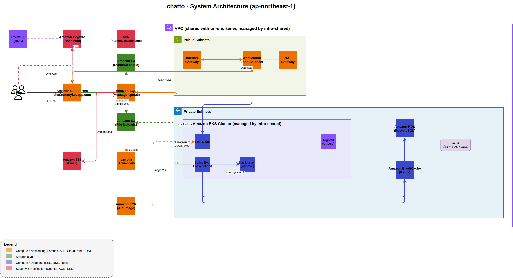

# chatto

リアルタイムチャットアプリ。フレンド、DM、リアクション、メンション、既読、タイピングインジケーター、全文検索、画像送信、Web Push 通知、メール通知を実装。

## 構成図



> [docs/architecture.drawio](docs/architecture.drawio) を draw.io で開くと編集できる

## 使った技術

| | |
|---|---|
| バックエンド | Java 21 + Spring Boot 3.4 |
| フロント | SvelteKit 2, Svelte 5, Tailwind CSS v4, shadcn-svelte |
| 認証 | Cognito (JWT, SRP認証) |
| DB | PostgreSQL (RDS) |
| キャッシュ | Redis (ElastiCache) |
| キュー | SQS (通知パイプラインの唯一の経路) |
| メール | SES (未読メッセージ通知、DKIM + DMARC) |
| 検索 | Elasticsearch (kuromoji日本語形態素解析、全ルーム横断検索) |
| 画像処理 | Lambda + sharp (S3アップロード時にサムネイル自動生成) |
| リアルタイム | WebSocket (STOMP) — CloudFront経由 |
| 通知 | Web Push (VAPID) + SESメール + アプリ内トースト + 未読バッジ |
| ファイル配信 | CloudFront signed URL (OAC + Trusted Key Group) |
| テスト | JUnit 5 + Mockito + Testcontainers / Vitest / Playwright |
| IaC | Terraform (S3バックエンド + DynamoDB state lock) |
| CI/CD | GitHub Actions + ArgoCD (CDワークフロー内でdigest更新 + git push) |
| 配信 | CloudFront (S3 + ALB + uploads を AWS Managed Policy で配信) |

## 使ってるAWSサービス

| サービス | 何してるか |
|---------|-----------|
| EKS | Spring Boot + Elasticsearch の Pod を動かすクラスタ (共有インフラ: infra-shared リポジトリで管理) |
| EC2 | EKSのワーカーノード (t3.medium) |
| ECR | Docker イメージ置き場 |
| RDS (PostgreSQL) | チャットルーム、メッセージ、メンバー、ユーザー、フレンドシップ、リアクションの保存 |
| ElastiCache (Redis) | オンライン状態の管理、未読カウント、既読状態、メール通知クールダウン |
| Cognito | ユーザー登録、ログイン、パスワードリセット、JWT 発行 |
| SQS | メッセージ送信時の通知処理キュー (DLQ付き) — 通知パイプラインの唯一の経路 |
| SES | 未読メッセージが溜まった時のメール通知 (DKIM + DMARC) |
| S3 | フロントの配信 + チャットで送るファイルの保存 + Terraform state |
| Lambda | 画像アップロード時のサムネイル自動生成 (S3 Event → sharp でリサイズ) |
| CloudFront | フロント + REST API + WebSocket + ファイル配信 (signed URL) |
| ALB | リクエスト振り分け + WebSocket 接続 |
| Route 53 | カスタムドメイン (chat.tommykeyapp.com) + SES DNS レコード (DKIM, DMARC, MAIL FROM) |
| ACM | SSL証明書 (*.tommykeyapp.com ワイルドカード、共有インフラで管理) |
| IAM | Pod に S3/SQS/SES のアクセス権を付与 (IRSA) |

## API ドキュメント

📖 **[Swagger UI](https://tommykey-apps.github.io/chat/)**

## 機能

### チャット
- リアルタイムメッセージ送受信（WebSocket / STOMP）
- メッセージの編集・削除（送信者のみ、hover時に表示）
- 絵文字リアクション（👍 ❤️ 😂、トグル式）
- @メンション（入力サジェスト + ハイライト表示）
- タイピングインジケーター（「○○が入力中...」）
- 既読表示
- 全ルーム横断検索（kuromoji日本語形態素解析 + ハイライト）
- ルーム内メッセージ検索
- 画像アップロード（サムネイル自動生成 + クリックで原寸表示）
- ファイルアップロード（S3 presigned URL）
- 無限スクロール（ページネーション）
- 日付セパレーター（「今日」「昨日」「3月30日」）

### ルーム
- ルーム作成・参加・退出・削除
- DM ルーム作成時にフレンドを自動招待
- DM ルームの重複防止
- ルーム一覧に最後のメッセージプレビュー + 未読バッジ

### ユーザー
- サインアップ・ログイン・ログアウト（Cognito）
- パスワードリセット（メール確認コード）
- プロフィール設定（表示名の変更）
- オンライン/オフライン状態表示

### フレンド
- ユーザー検索（メールアドレスまたは名前）
- フレンド申請・承認・拒否・削除

### 通知
- アプリ内トースト通知 + 未読バッジ（STOMP `/user/queue/notifications`）
- ブラウザ Push 通知（Web Push API + VAPID + Service Worker）
- SQS による非同期通知パイプライン（フォールバックなし、唯一の経路）
- SES メール通知（未読5件以上で自動送信、1時間クールダウン）

## ディレクトリ構成

```
chatto/
├── api/          # Spring Boot (Java 21)
├── web/          # SvelteKit フロント（shadcn-svelte）
├── lambda/       # Lambda関数（サムネイル生成）
├── infra/        # Terraform（RDS, Redis, S3, SQS, SES, Lambda, CloudFront 等）
├── manifests/    # K8s マニフェスト + ArgoCD
├── docs/         # 構成図 (draw.io)
└── .github/      # GitHub Actions（CI/CD）
```

> VPC, EKS, ALB Controller, ACM証明書は [infra-shared](https://github.com/tommykey-apps/infra-shared) リポジトリで管理

## ローカルで動かす

```bash
flox activate                     # Java, Gradle, pnpm 等が使える
# PostgreSQL + Redis + Elasticsearch が自動起動 (docker-compose)

cd api && gradle bootRun --args='--spring.profiles.active=local' &
cd web && pnpm install && pnpm dev
```

フロントは DEV モードで Cognito 認証をスキップし、`dev-user` として自動ログインする。
API は `local` プロファイルで `LocalSecurityConfig` が有効になり、`dev-token` を受け付ける。
Vite のプロキシで `/api/*` と `/ws` が Spring Boot に流れる。

## デプロイ

main に push すると自動デプロイ。

```
main push → GitHub Actions
  ├── deploy-infra: terraform plan → apply (infra/ 変更時のみ、Lambda zip ビルド含む)
  ├── deploy-api: Docker build → ECR push → kustomize edit set image (digest) → git push
  │     → ArgoCD が auto sync → Pod 更新
  └── deploy-web: pnpm build → S3 sync → CloudFront invalidate
```

CDワークフロー内で kustomization.yaml の digest を直接更新。GitOps の原則を維持。

```bash
# インフラを手動で立てる/壊す場合
cd ~/dev/chat/infra && terraform apply
cd ~/dev/chat/infra && terraform destroy
```

## テスト

```bash
cd api && gradle test              # Backend ユニット + 結合テスト (Testcontainers)
cd web && pnpm test                # Frontend ユニットテスト (Vitest)
cd web && pnpm test:e2e            # E2E テスト (Playwright)
```

| カテゴリ | テスト数 | ツール |
|---------|---------|-------|
| Backend ユニット | 62 | JUnit 5 + Mockito |
| Backend 結合 | 24 | Testcontainers (PostgreSQL + Redis) |
| Frontend ユニット | 33 | Vitest |
| Frontend E2E | 7 | Playwright |

## WebSocket について

CloudFront 経由で WebSocket (STOMP) を通している。
`/ws` パスを ALB オリジンに振り分け、`Upgrade` / `Connection` ヘッダーを転送する設定。
