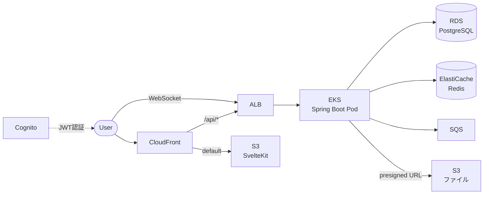

# Chat

リアルタイムチャットアプリ。AWSのサービスを色々組み合わせて作った。

## 構成図



## 使ってるAWSサービス

| サービス | 何してるか |
|---------|-----------|
| EKS | Spring Boot の Pod を動かすクラスタ（url-shortener と共有） |
| ECR | Docker イメージ置き場 |
| RDS (PostgreSQL) | チャットルーム、メッセージ、メンバーの保存 |
| ElastiCache (Redis) | オンライン状態の管理、WebSocket セッション |
| Cognito | ユーザー登録、ログイン、JWT 発行 |
| SQS | メッセージの非同期処理キュー |
| S3 | フロントの配信 + チャットで送るファイルの保存 |
| CloudFront | フロント + REST API の HTTPS 配信 |
| ALB | リクエスト振り分け + WebSocket 接続 |
| IAM | Pod に S3/SQS のアクセス権を付与 (IRSA) |

## 使った技術

| | |
|---|---|
| バックエンド | Java 21 + Spring Boot 3.4 |
| フロント | SvelteKit 2, Svelte 5, Tailwind CSS v4 |
| 認証 | Cognito (JWT) |
| DB | PostgreSQL (RDS) |
| キャッシュ | Redis (ElastiCache) |
| キュー | SQS |
| リアルタイム | WebSocket (STOMP) |
| IaC | Terraform |
| CD | ArgoCD (GitOps) |
| CI | GitHub Actions + flox |

## ディレクトリ構成

```
chat/
├── api/          # Spring Boot (Java 21)
├── web/          # SvelteKit フロント
├── infra/        # Terraform（EKS/VPC は url-shortener と共有）
├── manifests/    # K8s マニフェスト + ArgoCD
├── docs/         # 構成図
└── .github/      # CI/CD
```

## API

| Method | Path | 何するか |
|--------|------|---------|
| POST | `/api/rooms` | ルーム作成 |
| GET | `/api/rooms` | ルーム一覧 |
| GET | `/api/rooms/{id}` | ルーム詳細 |
| POST | `/api/rooms/{id}/join` | 参加 |
| DELETE | `/api/rooms/{id}/leave` | 退出 |
| GET | `/api/rooms/{id}/messages` | メッセージ履歴 |
| POST | `/api/files/presign-upload` | ファイルアップロード URL |
| GET | `/api/files/presign-download/{key}` | ファイルダウンロード URL |
| WebSocket | `/ws` | STOMP でリアルタイムメッセージ |

## ローカルで動かす

```bash
flox activate                     # Java, Gradle, pnpm 等が使える
# PostgreSQL + Redis が自動起動 (docker-compose)

cd api && gradle bootRun --args='--spring.profiles.active=local' &
cd web && pnpm install && pnpm dev
```

Vite のプロキシで `/api/*` と `/ws` が Spring Boot に流れる。

## デプロイ

url-shortener のインフラ（EKS, VPC）が先に必要。

```bash
# url-shortener のインフラを先に立てる
cd ~/dev/url-shortener/infra && terraform apply

# チャットアプリのインフラを立てる
cd ~/dev/chat/infra && terraform apply
```

使い終わったらチャット → url-shortener の順で壊す。

```bash
cd ~/dev/chat/infra && terraform destroy
cd ~/dev/url-shortener/infra && terraform destroy
```

## WebSocket について

CloudFront は WebSocket に対応してないので、WebSocket だけは ALB に直接繋いでる。
REST API とフロントは CloudFront 経由、WebSocket は ALB 直接、という構成。
