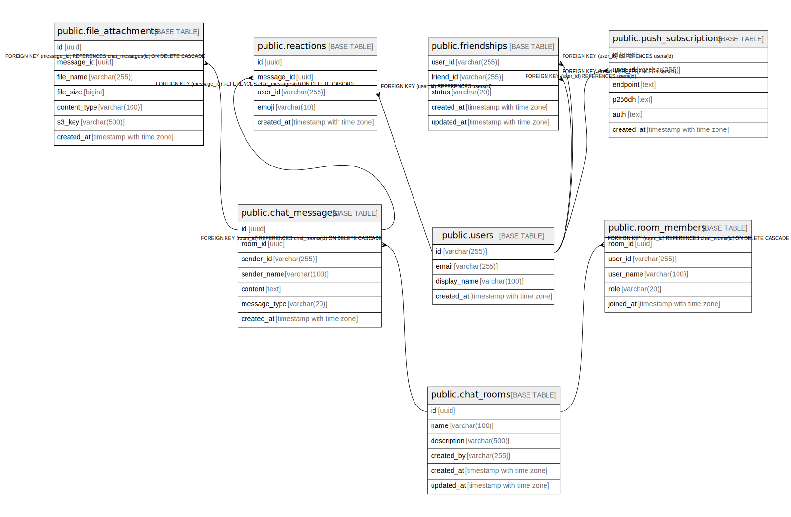

# chat

## Tables

| Name                                                      | Columns | Comment                                                                                                                                                       | Type       |
| --------------------------------------------------------- | ------- | ------------------------------------------------------------------------------------------------------------------------------------------------------------- | ---------- |
| [public.chat_rooms](public.chat_rooms.md)                 | 6       | Chat rooms (top-level conversation containers). Created via REST POST /api/rooms. created_by stores cognito_sub.                                    | BASE TABLE |
| [public.chat_messages](public.chat_messages.md)           | 7       | Messages within a chat room. ON DELETE CASCADE from chat_rooms. ChatMessageDocument (Elasticsearch) is a separate write path for full-text search.  | BASE TABLE |
| [public.room_members](public.room_members.md)             | 5       | Composite PK (room_id, user_id). Membership status is not modeled here (active/inactive); deletion implies removal.                                 | BASE TABLE |
| [public.file_attachments](public.file_attachments.md)     | 7       | Attachments belong to a single message. ON DELETE CASCADE from chat_messages. s3_key is the immutable S3 object key (no rename).                    | BASE TABLE |
| [public.users](public.users.md)                           | 4       | Cached user profile from Cognito (id = cognito_sub). Created lazily on first sign-in.                                                                    | BASE TABLE |
| [public.friendships](public.friendships.md)               | 5       | Composite PK (user_id, friend_id) with CHECK (user_id != friend_id). Bidirectional: a friendship has 2 rows after ACCEPTED.                         | BASE TABLE |
| [public.push_subscriptions](public.push_subscriptions.md) | 6       | Web Push API subscriptions per user. UNIQUE on endpoint to prevent duplicates.                                                                           | BASE TABLE |
| [public.reactions](public.reactions.md)                   | 5       | Emoji reactions on messages. UNIQUE (message_id, user_id, emoji) to prevent duplicate reactions. ON DELETE CASCADE from chat_messages.              | BASE TABLE |

## Relations

---

> Generated by [tbls](https://github.com/k1LoW/tbls)
