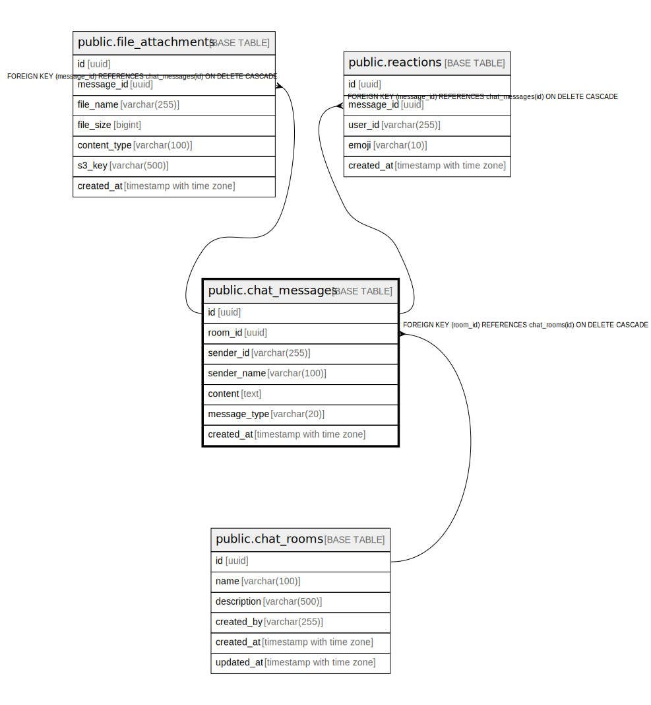

# public.chat_messages

## Description

Messages within a chat room. ON DELETE CASCADE from chat_rooms.  
ChatMessageDocument (Elasticsearch) is a separate write path for full-text search.  

## Columns

| Name         | Type                     | Default                   | Nullable | Children                                                                                      | Parents                                   | Comment |
| ------------ | ------------------------ | ------------------------- | -------- | --------------------------------------------------------------------------------------------- | ----------------------------------------- | ------- |
| id           | uuid                     | gen_random_uuid()         | false    | [public.file_attachments](public.file_attachments.md) [public.reactions](public.reactions.md) |                                           |         |
| room_id      | uuid                     |                           | false    |                                                                                               | [public.chat_rooms](public.chat_rooms.md) |         |
| sender_id    | varchar(255)             |                           | false    |                                                                                               |                                           |         |
| sender_name  | varchar(100)             |                           | false    |                                                                                               |                                           |         |
| content      | text                     |                           | true     |                                                                                               |                                           |         |
| message_type | varchar(20)              | 'TEXT'::character varying | false    |                                                                                               |                                           |         |
| created_at   | timestamp with time zone | now()                     | false    |                                                                                               |                                           |         |

## Constraints

| Name                       | Type        | Definition                                                        |
| -------------------------- | ----------- | ----------------------------------------------------------------- |
| chat_messages_room_id_fkey | FOREIGN KEY | FOREIGN KEY (room_id) REFERENCES chat_rooms(id) ON DELETE CASCADE |
| chat_messages_pkey         | PRIMARY KEY | PRIMARY KEY (id)                                                  |

## Indexes

| Name                      | Definition                                                                                       |
| ------------------------- | ------------------------------------------------------------------------------------------------ |
| chat_messages_pkey        | CREATE UNIQUE INDEX chat_messages_pkey ON public.chat_messages USING btree (id)                  |
| idx_chat_messages_room_id | CREATE INDEX idx_chat_messages_room_id ON public.chat_messages USING btree (room_id, created_at) |

## Relations

---

> Generated by [tbls](https://github.com/k1LoW/tbls)
