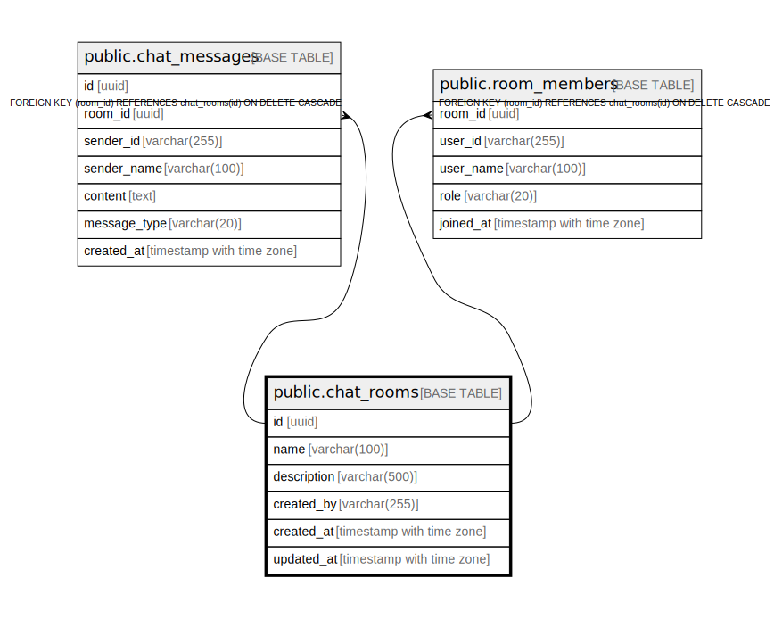

# public.chat_rooms

## Description

Chat rooms (top-level conversation containers). Created via REST POST /api/rooms.  
created_by stores cognito_sub.  

## Columns

| Name        | Type                     | Default           | Nullable | Children                                                                                      | Parents | Comment |
| ----------- | ------------------------ | ----------------- | -------- | --------------------------------------------------------------------------------------------- | ------- | ------- |
| id          | uuid                     | gen_random_uuid() | false    | [public.chat_messages](public.chat_messages.md) [public.room_members](public.room_members.md) |         |         |
| name        | varchar(100)             |                   | false    |                                                                                               |         |         |
| description | varchar(500)             |                   | true     |                                                                                               |         |         |
| created_by  | varchar(255)             |                   | false    |                                                                                               |         |         |
| created_at  | timestamp with time zone | now()             | false    |                                                                                               |         |         |
| updated_at  | timestamp with time zone | now()             | false    |                                                                                               |         |         |

## Constraints

| Name            | Type        | Definition       |
| --------------- | ----------- | ---------------- |
| chat_rooms_pkey | PRIMARY KEY | PRIMARY KEY (id) |

## Indexes

| Name                      | Definition                                                                           |
| ------------------------- | ------------------------------------------------------------------------------------ |
| chat_rooms_pkey           | CREATE UNIQUE INDEX chat_rooms_pkey ON public.chat_rooms USING btree (id)            |
| idx_chat_rooms_created_by | CREATE INDEX idx_chat_rooms_created_by ON public.chat_rooms USING btree (created_by) |

## Relations

---

> Generated by [tbls](https://github.com/k1LoW/tbls)
