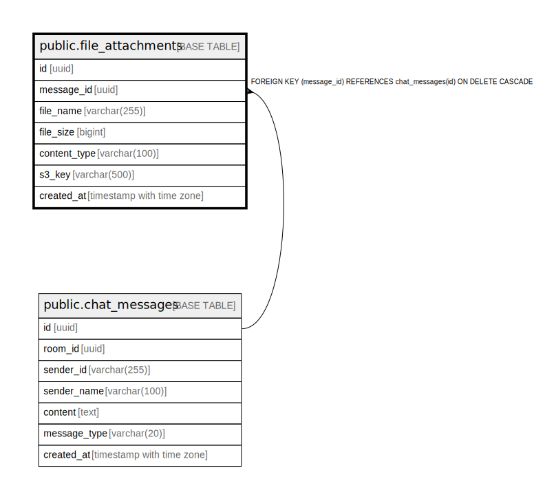

# public.file_attachments

## Description

Attachments belong to a single message. ON DELETE CASCADE from chat_messages.  
s3_key is the immutable S3 object key (no rename).  

## Columns

| Name         | Type                     | Default           | Nullable | Children | Parents                                         | Comment |
| ------------ | ------------------------ | ----------------- | -------- | -------- | ----------------------------------------------- | ------- |
| id           | uuid                     | gen_random_uuid() | false    |          |                                                 |         |
| message_id   | uuid                     |                   | false    |          | [public.chat_messages](public.chat_messages.md) |         |
| file_name    | varchar(255)             |                   | false    |          |                                                 |         |
| file_size    | bigint                   |                   | false    |          |                                                 |         |
| content_type | varchar(100)             |                   | false    |          |                                                 |         |
| s3_key       | varchar(500)             |                   | false    |          |                                                 |         |
| created_at   | timestamp with time zone | now()             | false    |          |                                                 |         |

## Constraints

| Name                             | Type        | Definition                                                              |
| -------------------------------- | ----------- | ----------------------------------------------------------------------- |
| file_attachments_message_id_fkey | FOREIGN KEY | FOREIGN KEY (message_id) REFERENCES chat_messages(id) ON DELETE CASCADE |
| file_attachments_pkey            | PRIMARY KEY | PRIMARY KEY (id)                                                        |

## Indexes

| Name                  | Definition                                                                            |
| --------------------- | ------------------------------------------------------------------------------------- |
| file_attachments_pkey | CREATE UNIQUE INDEX file_attachments_pkey ON public.file_attachments USING btree (id) |

## Relations

---

> Generated by [tbls](https://github.com/k1LoW/tbls)
