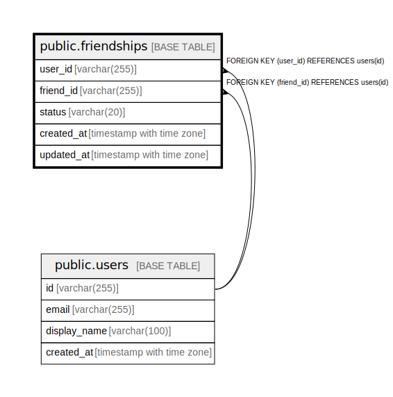

# public.friendships

## Description

Composite PK (user_id, friend_id) with CHECK (user_id != friend_id).  
Bidirectional: a friendship has 2 rows after ACCEPTED.  

## Columns

| Name       | Type                     | Default                      | Nullable | Children | Parents                         | Comment |
| ---------- | ------------------------ | ---------------------------- | -------- | -------- | ------------------------------- | ------- |
| user_id    | varchar(255)             |                              | false    |          | [public.users](public.users.md) |         |
| friend_id  | varchar(255)             |                              | false    |          | [public.users](public.users.md) |         |
| status     | varchar(20)              | 'PENDING'::character varying | false    |          |                                 |         |
| created_at | timestamp with time zone | now()                        | false    |          |                                 |         |
| updated_at | timestamp with time zone | now()                        | false    |          |                                 |         |

## Constraints

| Name                       | Type        | Definition                                     |
| -------------------------- | ----------- | ---------------------------------------------- |
| friendships_check          | CHECK       | CHECK (((user_id)::text <> (friend_id)::text)) |
| friendships_friend_id_fkey | FOREIGN KEY | FOREIGN KEY (friend_id) REFERENCES users(id)   |
| friendships_user_id_fkey   | FOREIGN KEY | FOREIGN KEY (user_id) REFERENCES users(id)     |
| friendships_pkey           | PRIMARY KEY | PRIMARY KEY (user_id, friend_id)               |

## Indexes

| Name                      | Definition                                                                                  |
| ------------------------- | ------------------------------------------------------------------------------------------- |
| friendships_pkey          | CREATE UNIQUE INDEX friendships_pkey ON public.friendships USING btree (user_id, friend_id) |
| idx_friendships_friend_id | CREATE INDEX idx_friendships_friend_id ON public.friendships USING btree (friend_id)        |
| idx_friendships_status    | CREATE INDEX idx_friendships_status ON public.friendships USING btree (status)              |

## Relations

---

> Generated by [tbls](https://github.com/k1LoW/tbls)
