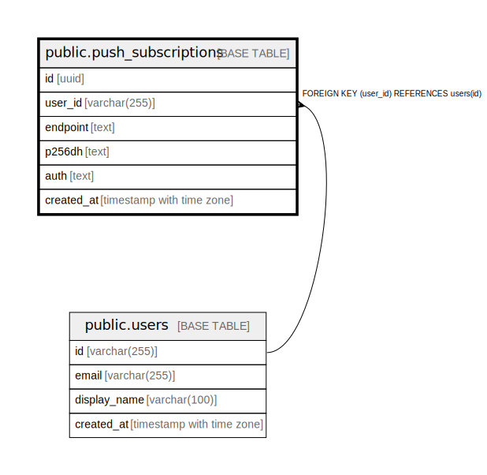

# public.push_subscriptions

## Description

Web Push API subscriptions per user. UNIQUE on endpoint to prevent duplicates.  

## Columns

| Name       | Type                     | Default           | Nullable | Children | Parents                         | Comment |
| ---------- | ------------------------ | ----------------- | -------- | -------- | ------------------------------- | ------- |
| id         | uuid                     | gen_random_uuid() | false    |          |                                 |         |
| user_id    | varchar(255)             |                   | false    |          | [public.users](public.users.md) |         |
| endpoint   | text                     |                   | false    |          |                                 |         |
| p256dh     | text                     |                   | false    |          |                                 |         |
| auth       | text                     |                   | false    |          |                                 |         |
| created_at | timestamp with time zone | now()             | false    |          |                                 |         |

## Constraints

| Name                            | Type        | Definition                                 |
| ------------------------------- | ----------- | ------------------------------------------ |
| push_subscriptions_user_id_fkey | FOREIGN KEY | FOREIGN KEY (user_id) REFERENCES users(id) |
| push_subscriptions_pkey         | PRIMARY KEY | PRIMARY KEY (id)                           |
| push_subscriptions_endpoint_key | UNIQUE      | UNIQUE (endpoint)                          |

## Indexes

| Name                            | Definition                                                                                              |
| ------------------------------- | ------------------------------------------------------------------------------------------------------- |
| push_subscriptions_pkey         | CREATE UNIQUE INDEX push_subscriptions_pkey ON public.push_subscriptions USING btree (id)               |
| push_subscriptions_endpoint_key | CREATE UNIQUE INDEX push_subscriptions_endpoint_key ON public.push_subscriptions USING btree (endpoint) |
| idx_push_subscriptions_user_id  | CREATE INDEX idx_push_subscriptions_user_id ON public.push_subscriptions USING btree (user_id)          |

## Relations

---

> Generated by [tbls](https://github.com/k1LoW/tbls)
