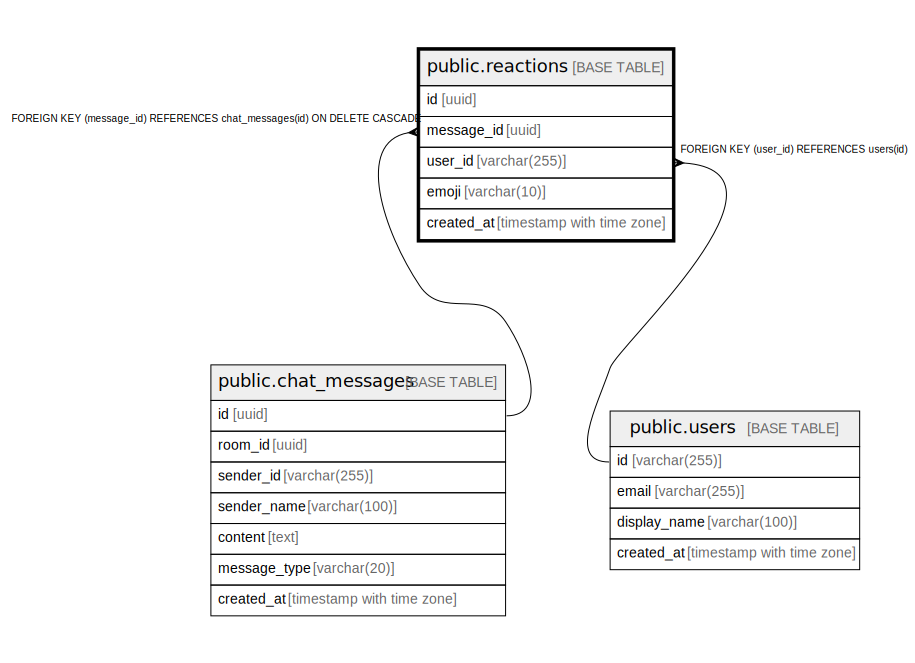

# public.reactions

## Description

Emoji reactions on messages. UNIQUE (message_id, user_id, emoji) to prevent duplicate reactions.  
ON DELETE CASCADE from chat_messages.  

## Columns

| Name       | Type                     | Default           | Nullable | Children | Parents                                         | Comment |
| ---------- | ------------------------ | ----------------- | -------- | -------- | ----------------------------------------------- | ------- |
| id         | uuid                     | gen_random_uuid() | false    |          |                                                 |         |
| message_id | uuid                     |                   | false    |          | [public.chat_messages](public.chat_messages.md) |         |
| user_id    | varchar(255)             |                   | false    |          | [public.users](public.users.md)                 |         |
| emoji      | varchar(10)              |                   | false    |          |                                                 |         |
| created_at | timestamp with time zone | now()             | false    |          |                                                 |         |

## Constraints

| Name                                   | Type        | Definition                                                              |
| -------------------------------------- | ----------- | ----------------------------------------------------------------------- |
| reactions_message_id_fkey              | FOREIGN KEY | FOREIGN KEY (message_id) REFERENCES chat_messages(id) ON DELETE CASCADE |
| reactions_user_id_fkey                 | FOREIGN KEY | FOREIGN KEY (user_id) REFERENCES users(id)                              |
| reactions_pkey                         | PRIMARY KEY | PRIMARY KEY (id)                                                        |
| reactions_message_id_user_id_emoji_key | UNIQUE      | UNIQUE (message_id, user_id, emoji)                                     |

## Indexes

| Name                                   | Definition                                                                                                              |
| -------------------------------------- | ----------------------------------------------------------------------------------------------------------------------- |
| reactions_pkey                         | CREATE UNIQUE INDEX reactions_pkey ON public.reactions USING btree (id)                                                 |
| reactions_message_id_user_id_emoji_key | CREATE UNIQUE INDEX reactions_message_id_user_id_emoji_key ON public.reactions USING btree (message_id, user_id, emoji) |
| idx_reactions_message_id               | CREATE INDEX idx_reactions_message_id ON public.reactions USING btree (message_id)                                      |

## Relations

---

> Generated by [tbls](https://github.com/k1LoW/tbls)
