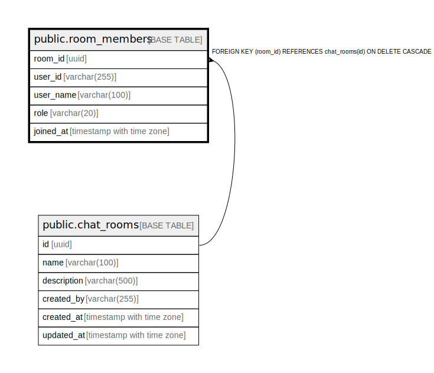

# public.room_members

## Description

Composite PK (room_id, user_id). Membership status is not modeled here  
(active/inactive); deletion implies removal.  

## Columns

| Name      | Type                     | Default                     | Nullable | Children | Parents                                   | Comment |
| --------- | ------------------------ | --------------------------- | -------- | -------- | ----------------------------------------- | ------- |
| room_id   | uuid                     |                             | false    |          | [public.chat_rooms](public.chat_rooms.md) |         |
| user_id   | varchar(255)             |                             | false    |          |                                           |         |
| user_name | varchar(100)             |                             | false    |          |                                           |         |
| role      | varchar(20)              | 'MEMBER'::character varying | false    |          |                                           |         |
| joined_at | timestamp with time zone | now()                       | false    |          |                                           |         |

## Constraints

| Name                      | Type        | Definition                                                        |
| ------------------------- | ----------- | ----------------------------------------------------------------- |
| room_members_room_id_fkey | FOREIGN KEY | FOREIGN KEY (room_id) REFERENCES chat_rooms(id) ON DELETE CASCADE |
| room_members_pkey         | PRIMARY KEY | PRIMARY KEY (room_id, user_id)                                    |

## Indexes

| Name              | Definition                                                                                  |
| ----------------- | ------------------------------------------------------------------------------------------- |
| room_members_pkey | CREATE UNIQUE INDEX room_members_pkey ON public.room_members USING btree (room_id, user_id) |

## Relations

---

> Generated by [tbls](https://github.com/k1LoW/tbls)
