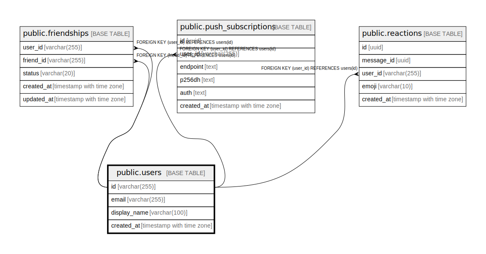

# public.users

## Description

Cached user profile from Cognito (id = cognito_sub). Created lazily on first sign-in.  

## Columns

| Name         | Type                     | Default | Nullable | Children                                                                                                                                      | Parents | Comment |
| ------------ | ------------------------ | ------- | -------- | --------------------------------------------------------------------------------------------------------------------------------------------- | ------- | ------- |
| id           | varchar(255)             |         | false    | [public.friendships](public.friendships.md) [public.push_subscriptions](public.push_subscriptions.md) [public.reactions](public.reactions.md) |         |         |
| email        | varchar(255)             |         | false    |                                                                                                                                               |         |         |
| display_name | varchar(100)             |         | false    |                                                                                                                                               |         |         |
| created_at   | timestamp with time zone | now()   | false    |                                                                                                                                               |         |         |

## Constraints

| Name            | Type        | Definition       |
| --------------- | ----------- | ---------------- |
| users_pkey      | PRIMARY KEY | PRIMARY KEY (id) |
| users_email_key | UNIQUE      | UNIQUE (email)   |

## Indexes

| Name            | Definition                                                              |
| --------------- | ----------------------------------------------------------------------- |
| users_pkey      | CREATE UNIQUE INDEX users_pkey ON public.users USING btree (id)         |
| users_email_key | CREATE UNIQUE INDEX users_email_key ON public.users USING btree (email) |

## Relations

---

> Generated by [tbls](https://github.com/k1LoW/tbls)
